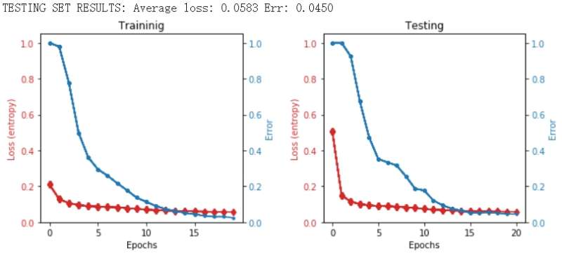
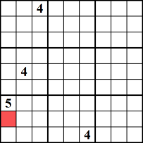

# Build an Explainable Sudoku Solver.

This repository contains the code for the Digital Sudoku SatNet project and it primarily refers to the ICML 2019 SatNet paper [https://icml.cc/Conferences/2019/Schedule?showEvent=3947]
We played with the number of parameters and get the model output printed.

## Background: What is SATNet?

SATNet is a differentiable (smoothed) maximum satisfiability (MAXSAT) solver that can be integrated into the loop of larger deep learning systems. Our (approximate) solver is based upon a fast coordinate descent approach to solving the semidefinite program (SDP) associated with the MAXSAT problem.

## What do these experiments do?

These experiments show that, by integrating the SATNet solver into end-to-end learning systems, we can learn the logical structure of challenging problems in a minimally supervised fashion. 
In particular, this file will show you some sample output of the SatNet-based mode to play 9×9 Sudoku (original and permuted) solely from examples.

## The Sudoku Dataset

The 10K 9x9 Sudoku boards (9K test/1K train) used in this project was from [https://github.com/Kyubyong/sudoku]

## The SatNet-based model

This model presents a differentiable optimization-based MAXSAT solver, namely an SDP relax-ation of MAXSAT,  and demonstrate  that SATNet can be integrated into larger deep network architecture for end toend training. 

In both forward and backward pass they use similar coor-dinate descent approach, which has similar fast convergence properties. This procedure enables the model to compute the desired gradients without needing to maintain intermediate Jacobians explicitly.

Here is a picture of the Forward Pass of the MAXSAT Layer.

(Image Source: SATNet: Bridging deep learning and logical reasoning usinga differentiable satisfiability solver, Wang et al, ICML 2019)

## Experiment procedure and sample results

After we trained the model with the training set, we test its performance with the test dataset.

First, the game started with an unsolved Sudoku, with several initially filled digits. An example from the test:

After the initially unsolved Sudoku went through the SatNet-based model, we printed out the output to visualize the performance of the model. 

For illustration, we painted the model generated digits in green and red. 

If the digits are correctly generated, we painted it green. 
If the digits are wrong, we painted it red. 

We checked the result up until 20 epochs for the first sample in our test set, and found that starting from 4 until 20 epochs, the model does a perfect job in generating the right answer. 

For convenience, we decided to attach only the first 4 epochs results for the first sample in our test set as a demonstration.

## Model evaluation
After we run training set with 20 epochs, the accuracy of solving standard Sudoku is 95.5%, as shown in the figure below. 
The accuracy can be improved to over 99% when we increase the number of epochs to 100, but doesn’t improve much over 50 epochs. For our project, the next step is: generate our own dataset for solving a digital Kakuro problem.

## Model Modification
We modify the model with the hope that it explains the step-by-step process of solving a Sudoku puzzle.
###### Data Preparation: 
We manually solved 32 Sudokuboards  and  relabelled  each  with  the  strategies  we  take  in each step, making sure to record the position, step number and labels. 
Two Sudoku Solving stratgies we use:
 1. Sole Candidate
 

 2. Unique Candidate
 

Using the two defined strategies, each time we record a number to a cell, we also record which strategy this step takes, as well as the order of the step. In the end, for each solved Sudoku(Fig.11), there are both a rule index matrix(Fig.12) and a step index matrix(Fig.13) For example, in Figure 10, if the 5 in row 1, column 1 was put there by us in the 10th step of solving the board, using the "sole candidate" strategy, then we put 1 in row1, column1 of the corresponding index matrix, and 10 in the corresponding step index matrix. 

a solved sudoku

a corresponding rule index matrix

a corresponding step index matrix

###### Result
We present one example output of the model

0 means the numberis already given. 
”sole” means this number is determined by strategy 1: sole candidate. 
”unique” means this number is de-cided by strategy 2, unique candidate. 

From this model, we can predict the solving rules the model uses in filling each number. 
The accuracy of this rule prediction is 90% on training data and 70% on testdata. 
We were short on time and only relabelled 30 Sudoku boards.  
So there was an overfitting issue. 
